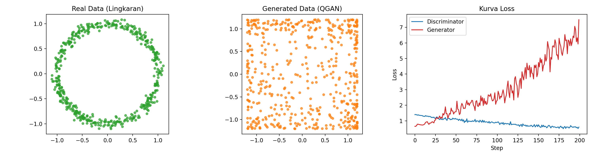

# Quantum GAN – Variational Quantum Generator + Classical Discriminator



# Quantum GAN: PennyLane + PyTorch
This project implements a Quantum Generative Adversarial Network (QGAN) combining a variational quantum generator with a classical discriminator, for 2D synthetic data generation and visualization.


## 🔹 Project Description

This project implements a **Quantum Generative Adversarial Network (QGAN)** with:
- **Quantum Generator**: using **Variational Quantum Circuit (VQC)** via **PennyLane**  
- **Classical Discriminator**: Multi-Layer Perceptron (MLP) implemented in **PyTorch**  

**Project Goals:**
1. Explore the **combination of quantum computing and classical machine learning**.  
2. Generate 2D synthetic data in the shape of a noisy circle resembling real data.  
3. Provide visualization and training loss analysis.  
4. Demonstrate potential of **Quantum GANs** for physics simulations, biological data, and synthetic datasets.

> 🔬 The project also supports **Qiskit Aer**, enabling quantum expectation inference and noise simulation.

---

## 🔹 Key Features

- Quantum generator using **PennyLane QNode**  
- Simple yet effective classical discriminator  
- Synthetic 2D circular noisy dataset  
- Visualization:
  - Real vs Generated data  
  - Generator & Discriminator loss curves  
- Optional support for **Qiskit Aer** noise simulation

---


---

## 🔹 Installation

Recommended to use **Python 3.12** and a virtual environment:

```bash
# 1. Install Python 3.12 via Homebrew
brew install python@3.12

# 2. Create virtual environment
python3.12 -m venv venv
source venv/bin/activate

# 3. Upgrade pip
pip install --upgrade pip

# 4. Install dependencies
pip install numpy matplotlib pennylane torch qiskit qiskit-aer

# Activate virtual environment
source venv/bin/activate

# Run the QGAN
python3 main.py

results/qgan_training_summary.png
😊🫰

